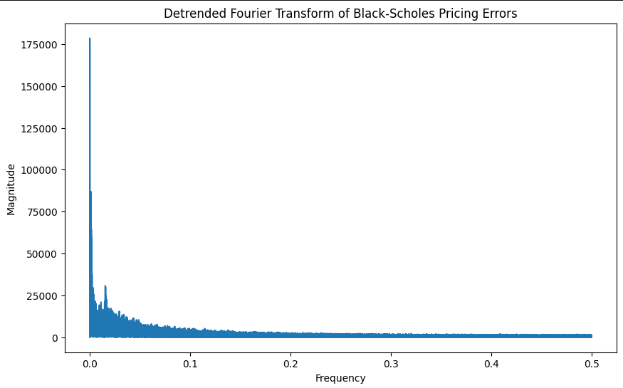

# Black-Scholes Model Correction and Market Analysis

## Overview
This project explores the limitations of the Black-Scholes model in pricing options, investigates pricing errors, and applies corrections using entropy and nonlinear modeling techniques. We analyze volatility regimes and backtest a corrected trading strategy.

## Data Source
This dataset was sourced from **Kaggle**, containing historical options pricing data, including bid-ask spreads, implied volatility, and market conditions. The data provides a robust testbed for evaluating pricing discrepancies in financial markets. We use it to analyze the relationship between the theoretical Black-Scholes prices and observed market bid/ask prices.

## Goals
- Identify systematic biases in the Black-Scholes pricing model.
- Incorporate entropy as a measure of market uncertainty.
- Explore Fourier and wavelet analyses to detect underlying patterns.
- Develop a corrected pricing model incorporating implied volatility and entropy.
- Evaluate model performance under different volatility regimes.
- Backtest a trading strategy based on the corrected model.

## Key Analyses and Insights

### 1. Pricing Errors in Black-Scholes
We started by calculating the bid and ask pricing errors relative to the Black-Scholes price.

The errors are highly skewed, with a large peak around zero, suggesting some accuracy but significant deviations at the tails.

### 2. Rolling Entropy and Implied Volatility
Entropy is used to capture market uncertainty. Rolling entropy for pricing errors shows patterns of regime shifts that align with implied volatility movements.

### 3. Frequency Analysis
Using Fourier and wavelet transforms, we analyze periodic structures in pricing errors. The Fourier spectrum shows dominant low-frequency components, while wavelet analysis highlights localized fluctuations over time.

### 4. Corrected Model Using Entropy and Nonlinear Terms
We extended our regression model to incorporate entropy and nonlinear transformations of implied volatility.

- First correction using entropy:
  

- Nonlinear regression with squared and interaction terms:
  

The addition of entropy significantly improves the model’s explanatory power.

### 5. Model Performance Across Volatility Regimes
To understand how pricing errors behave under different market conditions, we classified data into **low**, **medium**, and **high** volatility regimes. The distribution of pricing errors is analyzed before and after correction.

- Before correction:
  

- After entropy-based correction:
  

### 6. Backtesting a Trading Strategy
A backtested strategy based on model corrections is visualized in cumulative profit terms.

This analysis shows that market inefficiencies can be systematically exploited using our corrected pricing approach.

---

## Conclusion
- The Black-Scholes model exhibits systematic pricing errors.
- Incorporating entropy captures market uncertainty, improving model accuracy.
- Nonlinear interactions between implied volatility and entropy further refine the model.
- The corrected model performs well under different volatility regimes.
- A trading strategy based on the corrected model demonstrates profit potential.

This project serves as a non-standard, data-driven exploration of financial modeling. 